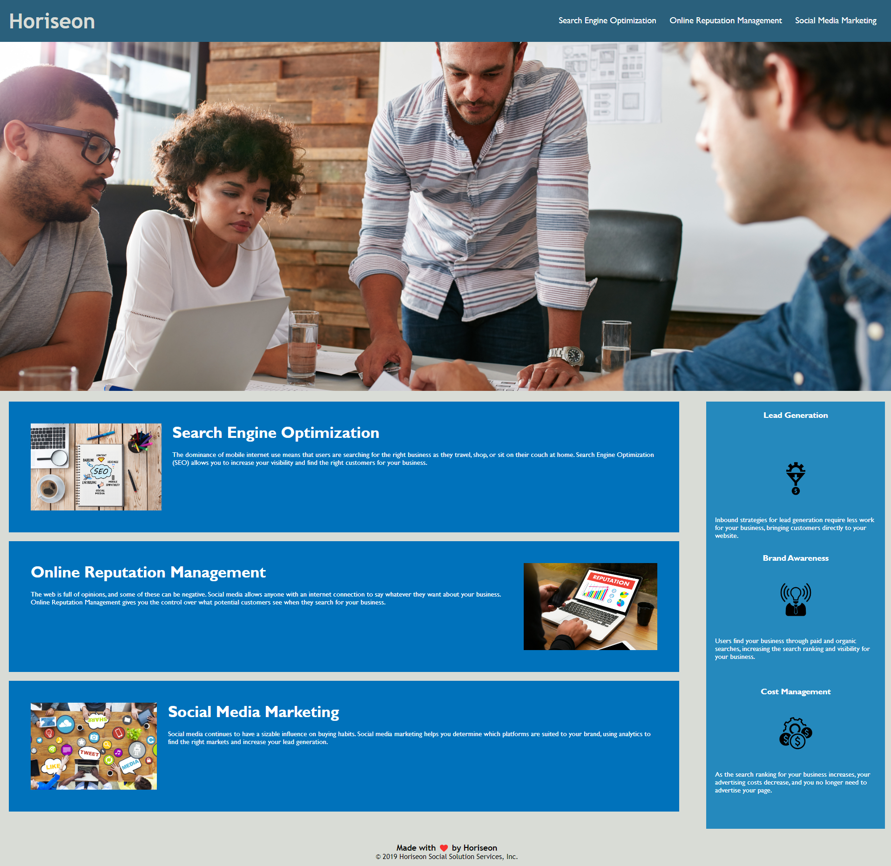

# Horiseon-Inc

## Description
Horiseon is a digital marketing company that help businesses market their products and services.
Its expertise include Search Engine Optimisation, Online Reputation Management, and Social Media Marketing 
to enable firms to launch successful products. The integration of technology in its operation allows to target
customers, and provide them the rights services to meet their needs.
Furthermore, the website takes into consideration web accessibility which is of 
paramount importance. More specifically, we integrate it in the process to enable everyone especially users with disabilities to access it more easily. We allow them to positively interact on the digital platform , 
and therefore generate more traffic. 

## Table of contents

## Screenshot

## Technologies
Project is created with:
- HTML 5
- CSS

## Contributors

## Documentation

## Licence

Licensed under MIT License. See license for more information.

Copyright (c) 2022 cedagbo

## Author
@cedagbo
